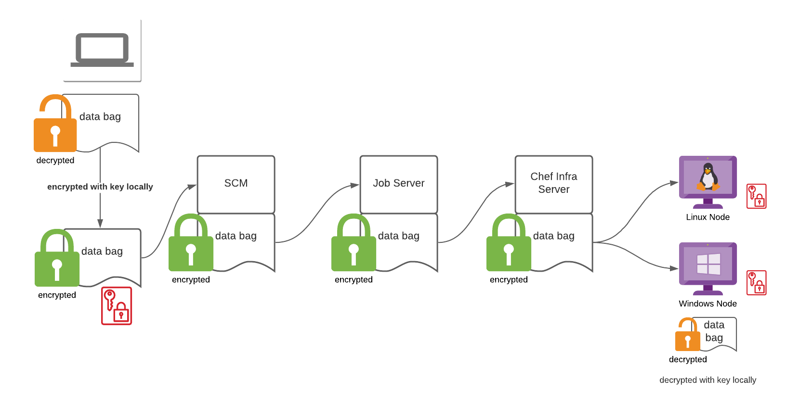

# Encrypted Data Bag Repo



_Make sure you follow the [this guide](https://github.com/chef-cft/chef-examples/blob/master/examples/ChefTestKitchenEncryptedDataBags.md)
to get setup with local encrypted data bags before using this._

**This repo is a template** that can be used to:
* Ensure all data bags are encrypted prior to being committed to SCM.
* Automate the locking (for commit) and unlocking (for editing) of data bags in
a secure manner.
* Provide a sane, repeatable pattern for teams using encrypted data bags.

## Create Data Bags
1. Clone this repo locally, copy it into your own repo.
1. Copy your encrypted data bag secret into the `secrets/` directory and name it
something unique, for example, if the app is `ymir` call it `ymir_secret` or 
something similar, try to avoid calling it the same across data bag repos 
because we can pull these keys in during Test Kitchen runs and if they have
unique names it makes life easier.
1. Create your data bags in the `data_bags` directory, you can use the
examples as a guide, basically it's `data_bags\bagName\bagItem-open.json`, be sure to end them in `-open.json` because this is the pattern that is 
looked for when running the encrypt script.

## Encrypt Data Bags for Committing
1. Run the `scripts/dbag-ops.sh -l -s <secret file path> [ -p <bagName> ]` which will encrypt each data bag in the 
`data_bags` path into it's own new file removing `-open.json`. You can specify a pattern with `-p *bagname*` if you want to limit the scope of the operation, example:
    ```
    # Lock all data bags in the `data_bags` path:
    ./dbag-ops.sh -l -s ../secrets/my_super_secret

    # Lock specific data bags in the `data_bags` path:
    ./dbag-ops.sh -l -s ../secrets/my_super_secret -p ymir-api
    ```
1. When finished editing, run `scripts/lock.sh` to encrypt all `*-open.json` 
files (overwriting the original), and then delete them.

## Decrypt Data Bags for Editing
1. Run the `scripts/dbag-ops.sh -u -s <secret file path> [ -p <bagName> ]` which will decrypt each data bag in the 
`data_bags` path into it's own new file, appending `-open.json`. You can specify a data bag name with `-p bagname` if you want to limit the scope of the operation, example:
    ```
    # Lock all data bags in the `data_bags` path:
    ./dbag-ops.sh -l -s ../secrets/my_super_secret

    # Lock a specific data bag in the `data_bags` path:
    ./dbag-ops.sh -l -s ../secrets/my_super_secret -p ymir-api
    ```
1. Don't delete or change the file that was created with `-open.json`, edit this
file directly to change the data bag values, then save it prior to encrypting.

## Automatically Test for non-Encrypted Data Bags Before a Commit
When using GitHub, you can use a `pre-commit` hook to run a script prior to 
allowing a `git commit` operation to continue. To do this, create a file called
`.git/hooks/pre-commit` in the base of the repo, and add the follwing content:
```
#!/bin/bash

for d in data_bags/*/ ; do
  for f in $d* ; do
    if grep -q 'encrypted_data' $f; then
      echo "$f is encrypted [PASS]"
    else
      echo "$f contains non-encrypted data, please run the lock.sh script before committing again [FAIL]"
      exit 1
    fi
  done
done
```

When you run `git commit` you'll see this output if all of your data bags are
encrypted properly:

```
git commit -m "Updating README.md and other things..."
data_bags/ymir-api/attributes.json is encrypted [PASS]
data_bags/ymir-api/regions.json is encrypted [PASS]
data_bags/ymir-backend/attributes.json is encrypted [PASS]
data_bags/ymir-base/attributes.json is encrypted [PASS]
data_bags/ymir-cache/attributes.json is encrypted [PASS]
data_bags/ymir-lb/attributes.json is encrypted [PASS]
data_bags/ymir/attributes.json is encrypted [PASS]
[updating_ymir 4db5999] Updating README.md and other things...
 3 files changed, 46 insertions(+)
 create mode 100755 scripts/lock.sh
 create mode 100755 scripts/pre-commit.sh
 create mode 100644 scripts/unlock.sh
```

By following this guide, you can make sure that your data bags are always 
encrypted prior to being uploaded to SCM.

## Copy Your Data Bag Secrets to Nodes
There are really two ways you can do this (3, but the 3rd way is manual so I 
won't even cover it here).

1. First, during the node provisioning process, whatever it may be, copy your 
data bag secrets to the node. This could be at image creation time 
(Packer, kickstart, etc...), or it could be at deployment time (Terraform, 
Cloud Formation, Azure Templates...).
1. Second (and better), you can use `chef-run` to deploy your data bag
secrets using a simple recipe. Copy the example recipe in 
`scripts/dbag-secrets-example.rb` to a new file called `dbag-secrets.rb`. Edit
the file and replace the recipe with your own content, then run against your
nodes, here's an example:
    ```
    chef-run ymir-api-00.dbright.io,ymir-lb-00.dbright.io,ymir-cache-00.dbright.io,ymir-backend-00.dbright.io dbag-secrets.rb -i ~/.ssh/id_rsa
    [✔] Packaging cookbook... done!
    [✔] Generating local policyfile... exporting... done!
    [✔] Applying dbag-secrets from dbag-secrets.rb to targets.
    ├── [✔] [ymir-api-00.dbright.io] Successfully converged dbag-secrets.
    ├── [✔] [ymir-lb-00.dbright.io] Successfully converged dbag-secrets.
    ├── [✔] [ymir-cache-00.dbright.io] Successfully converged dbag-secrets.
    └── [✔] [ymir-backend-00.dbright.io] Successfully converged dbag-secrets.
    ```
_When using the 
[attributes-loader cookbook](https://github.com/danielcbright/attributes-loader)
I highly recommend that each data bag repo has it's own secret key, and they are
placed in the `chef` directory on the node._

## Using the Data Bag Repo with Test Kitchen
This will assume a specific local directory structure on your local system, you
will need to adjust things based on how you clone/stage repos and development
directories on your own workstation.

Let's assume that you have a directory structure for local development that
looks like this:

```bash
chef-root
|
├── global-data-bags
│   ├── data_bags
│   └── secrets
|
|   # App Repo
├── ymir
|   |
*   │   # Data Bag Repos
    ├── global-data-bags
    │   ├── data_bags
    │   └── secrets
    │       └── global_secret
    ├── ymir-data-bags
    │   ├── data_bags
    │   └── secrets
    │       └── ymir_secret
    │
    │   # Policy Cookbook Repos
    ├── ymir-api-policy
    │   └── kitchen.yml
    ├── ymir-backend-policy
    │   └── kitchen.yml
    ├── ymir-base-policy
    │   └── kitchen.yml
    ├── ymir-cache-policy
    │   └── kitchen.yml
    └── ymir-lb-policy
        └── kitchen.yml
```

With this structure, I want to setup my Test Kitchen configuration to do two
things:

1. Provision the kitchen instance with the data bag secrets that I need to 
decrypt data bags.
1. Tell Test Kitchen where my data bags are on disk so it will use them.

I can do that by adding `data_path` and `data_bags_path` entries into my 
`kitchen.yml` like so:
```yml
provisioner:
  name: chef_zero
  deprecations_as_errors: true
  chef_license: accept-no-persist
  product_name: chef
  product_version: 16
  client_rb: 
    data_collector.server_url: 'https://<YOUR AUTOMATE URL>/data-collector/v0/'
    data_collector.token: '<YOUR DATA_COLLECTOR TOKEN>'
    chef_guid: '<CREATE YOUR OWN UUID>'
    node_name: 'tk-centos7-ymirbase'
  data_path: 
    - "../global-data-bags/secrets/"
    - "../ymir-data-bags/secrets/"
  data_bags_path: 
    - "../global-data-bags/data_bags/"
    - "../ymir-data-bags/data_bags/"
```

What does this do? It copies over the secrets that are listed in `data_path` to
a `tmp` directory on the newly provisioned Kitchen instance. In Linux, this will
be under `/tmp/kitchen/data` and Windows will be `C:\Users\<username>\AppData\Local\Temp\kitchen\data`.

Now I need to tell my cookbooks to use the right secret file, this is assuming
you have all `data_bag_item()` loads set to use a secret file and not the
default, for example, when using the [attributes-loader](https://github.com/danielcbright/attributes-loader) cookbook it requires default attributes to be
set like this:
```
# attributes/default.rb

default['attributes-loader']['dbags'] = {
  "global": {
    "secret_file": '/opt/chef/global_secret',
  },
  "ymir": {
    "secret_file": '/opt/chef/ymir_secret',
  },
  "ymir-base": {
    "secret_file": '/tmp/kitchen/data/ymir_secret',
  },
}
```
So in the `kitchen.yml` under `suites`, I would just do this:
```yml
suites:
  - name: default
    provisioner:
      policyfile: Policyfile.rb
    attributes:
      attributes-loader:
        dbags:
          global:
            secret_file: "/tmp/kitchen/data/global_secret"
          ymir:
            secret_file: "/tmp/kitchen/data/ymir_secret"
          ymir-base:
            secret_file: "/tmp/kitchen/data/ymir_secret"
    verifier:
      name: inspec
```

You can use this configuration for all of the Policy Cookbook Repos that are
under the same `app` leaf, that way it's all consistent.